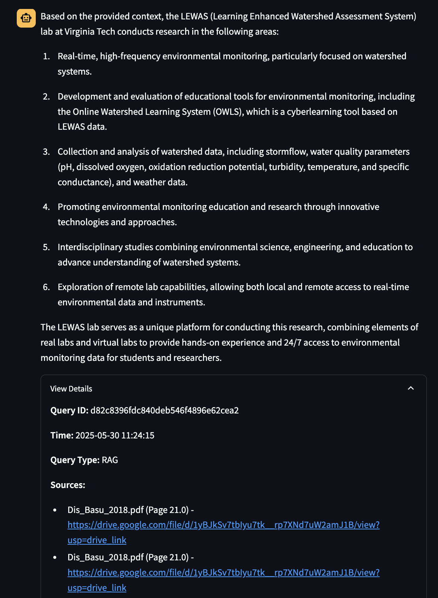
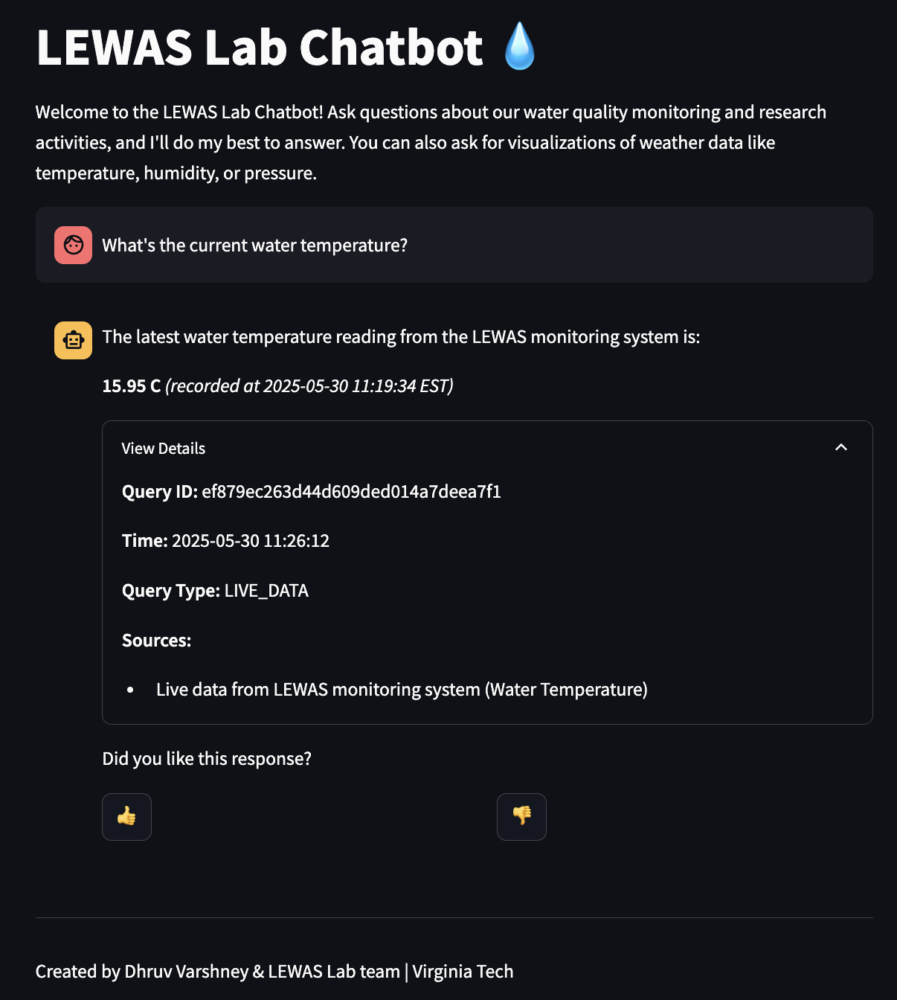
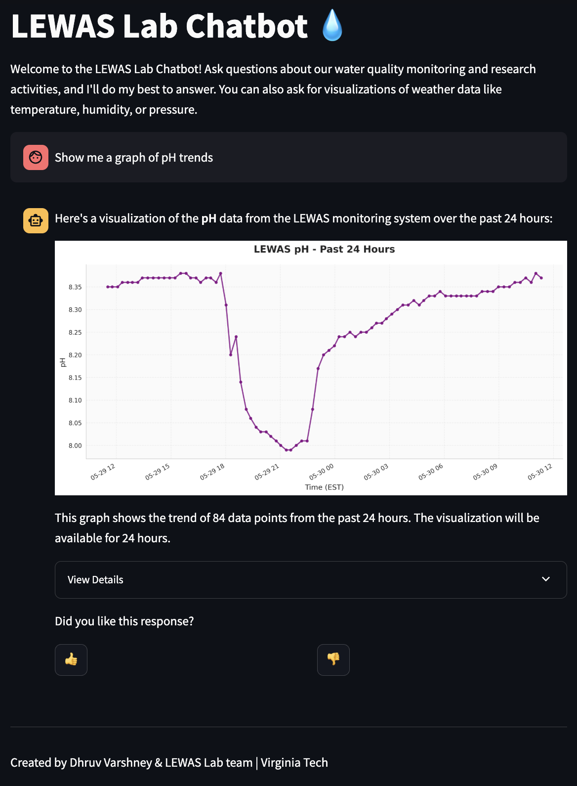

# LEWAS AI Chatbot Frontend - Interactive Environmental Data Assistant

> **Learning Enhanced Watershed Assessment System (LEWAS) Lab**  
> Virginia Tech - Conversational Interface for Environmental Research

## 🛠️ Technologies Used


## 🌐 Live Demo

🔗 **Access the Chatbot**: [https://lewaschatbot.streamlit.app/](https://lewaschatbot.streamlit.app/)

## 🤖 Overview

The LEWAS AI Chatbot Frontend is an intuitive Streamlit web application that provides a conversational interface to access LEWAS Lab's research knowledge and real-time environmental data. This interactive assistant serves as the user-facing component of our AI-powered system, enabling researchers, students, and the public to explore a decade of watershed research and current sensor data through natural language queries.

> **🔗 Related Projects**: This frontend connects to the [LEWAS Chatbot Backend](https://github.com/lewas-lab/chatbot-backend) for AI processing and accesses live data from the [LEWAS Backend](https://github.com/lewas-lab/lewas-backend). Users can also explore data visually using the [LEWAS Frontend Dashboard](https://github.com/lewaslab/lewas-frontend).

## ✨ Key Features

### 🧠 **Intelligent Conversation Interface**

- **Natural Language Processing**: Ask questions in plain English
- **Context-Aware Responses**: Maintains conversation context
- **Multi-Modal Responses**: Text, data tables, and visualizations
- **Real-Time Interaction**: Instant responses from backend AI

### 📚 **Three-Way Knowledge Access**

1. **📖 Research Knowledge (RAG)**: Access LEWAS Lab's research papers and documentation
2. **📊 Live Environmental Data**: Get current sensor readings and recent trends
3. **📈 Data Visualizations**: Generate charts and graphs on demand

### 🎯 **Smart Query Understanding**

The chatbot automatically determines what you're asking for:

- **"What's the current water temperature?"** → Live sensor data
- **"Show me pH trends"** → Data visualization
- **"Tell me about LEWAS research"** → Knowledge base search
- **"How does stormwater affect measurements?"** → Research documentation

### 🌊 **Comprehensive Environmental Coverage**

- **16 Environmental Parameters** across water quality, flow, and weather
- **Real-Time Sensor Readings** from Webb Branch watershed
- **Historical Data Access** for trend analysis
- **Research-Grade Processing** with same algorithms used in publications

## 🚀 Quick Start

### Live Demo

🌐 **Access the Chatbot**: [https://lewaschatbot.streamlit.app/](https://lewaschatbot.streamlit.app/)

### Local Development

1. **Clone the repository**

```bash
git clone https://github.com/lewas-lab/chatbot-frontend
cd chatbot-frontend
```

2. **Install dependencies**

```bash
pip install -r requirements.txt
```

3. **Configure environment**

```bash
# Copy ./streamlit/secrets_example.toml
# Rename it to secrets.toml
cp ./streamlit/secrets_example.toml secrets.toml
# Fill in all the values
```

3. **Create a Virtual Environment for Python, using the requirements.txt file**

4. **Run the application**

```bash
streamlit run src/main.py
```

5. **Access the interface**
   Open your browser to [http://localhost:8501](http://localhost:8501)

## 🎛️ User Interface

### Main Chat Interface

- **Message Input**: Type your questions in the chat box
- **Send Button**: Submit queries with Enter or click
- **Response Display**: Formatted responses with sources
- **View Details**: Expandable sections for technical details
- **Feedback System**: Thumbs up/down for response quality

### Sidebar Features

- **About LEWAS Lab**: Information about the research facility
- **Example Questions**: Sample queries to get started
- **Contact Information**: Support and development contacts

### Response Types

- **Text Answers**: Comprehensive explanations and information
- **Live Data**: Current sensor readings with timestamps
- **Visualizations**: Embedded charts and graphs
- **Source Citations**: Links to original research documents

## 📊 Environmental Parameters

### 🧪 Water Quality Parameters

Ask about any of these water quality measurements:

| Parameter              | Description                   | Example Query                      |
| ---------------------- | ----------------------------- | ---------------------------------- |
| `ph`                   | Water acidity/alkalinity      | "What's the current pH?"           |
| `dissolved_oxygen`     | Oxygen content in water       | "How much oxygen is in the water?" |
| `water_temperature`    | Water thermal conditions      | "What's the water temperature?"    |
| `turbidity`            | Water clarity measurement     | "How cloudy is the water?"         |
| `specific_conductance` | Electrical conductivity       | "What's the conductivity reading?" |
| `salinity`             | Salt content measurement      | "How salty is the water?"          |
| `orp`                  | Oxidation reduction potential | "What's the ORP level?"            |

### 🌊 Water Flow Parameters

Explore water movement and dynamics:

| Parameter             | Description                | Example Query                |
| --------------------- | -------------------------- | ---------------------------- |
| `stage`               | Water level/height         | "How high is the water?"     |
| `flow_rate`           | Volumetric flow estimation | "What's the flow rate?"      |
| `smoothed_velocity`   | Processed water speed      | "What's the water velocity?" |
| `downstream_velocity` | Raw velocity measurement   | "Current water speed?"       |

### 🌤️ Weather Parameters

Check atmospheric conditions:

| Parameter           | Description                | Example Query                   |
| ------------------- | -------------------------- | ------------------------------- |
| `air_temperature`   | Atmospheric temperature    | "How hot is it outside?"        |
| `humidity`          | Relative humidity          | "What's the humidity level?"    |
| `air_pressure`      | Barometric pressure        | "What's the air pressure?"      |
| `rain_intensity`    | Current precipitation rate | "Is it raining hard?"           |
| `rain_accumulation` | Total rainfall amount      | "How much rain has fallen?"     |
| `rain_duration`     | Precipitation event length | "How long has it been raining?" |

## 💬 Example Conversations

### Getting Research Information

```
You: "What research does LEWAS Lab conduct?"

🤖 Chatbot:
```



### Getting Live Data

```
You: "What's the current water temperature?"

🤖 Chatbot:
```



### Getting Visualizations

```
You: "Show me a graph of pH trends"

🤖 Chatbot:
```



## 🎯 Query Types and Examples

### 📚 Research Knowledge Queries

- "Describe the acute chloride toxicity event at LEWAS"
- "How does stormwater affect LEWAS measurements?"
- "What sensors are deployed at the monitoring site?"
- "Explain the data flow between LEWAS components"
- "What publications has LEWAS Lab produced?"

### 📊 Live Data Queries

#### **Latest Readings (Single Values)**

- "What is the current air temperature?"
- "Latest humidity reading?"
- "How much dissolved oxygen right now?"
- "Current water level?"

#### **Recent Trends (Multiple Values)**

- "Show me recent temperature readings"
- "pH measurements from today"
- "Last few hours of pressure data"
- "Recent flow rate changes"

### 📈 Visualization Queries

- "Create a graph of temperature trends"
- "Show me humidity data visualization"
- "Generate a plot of air pressure over time"
- "Chart the dissolved oxygen levels"
- "Visualize rainfall patterns"

### 🔍 Technical Queries

- "How does the monitoring system work?"
- "What's the sampling frequency of sensors?"
- "Explain the data processing pipeline"
- "What quality control measures are used?"

## 🎨 Interface Customization

### Streamlit Configuration

```toml
# .streamlit/config.toml
```

## 📱 Responsive Design

### Mobile Optimization

- **Touch-Friendly**: Large buttons and input areas
- **Responsive Layout**: Adapts to different screen sizes
- **Optimized Images**: Compressed visualizations for faster loading
- **Simplified Navigation**: Streamlined mobile interface

### Accessibility Features

- **Keyboard Navigation**: Full keyboard support
- **High Contrast**: Accessible color combinations
- **Clear Typography**: Readable fonts and sizing

## 🔄 Deployment

### Streamlit Cloud (Recommended)

1. **Connect GitHub Repository**

   - Link your GitHub account to Streamlit Cloud
   - Select the repository containing your app

2. **Configure Deployment**

   ```toml
   # .streamlit/config.toml
    [server]
    enableCORS = false
    enableXsrfProtection = false

    [theme]
    base="dark"
   ```

3. **Set Secrets**

   ```bash
   # Copy ./streamlit/secrets_example.toml
   # Rename it to secrets.toml
   cp ./.streamlit/secrets_example.toml ./.streamlit/secrets.toml
   # Fill in all the values
   ```

4. **Deploy Application**
   - Automatic deployment on git push
   - Real-time logs and monitoring

## 🧪 Development

### Project Structure

```
rag-chatbot-frontend/
├── src/
│   ├── Home.py              # Main application entry
│   ├── main.py              # Core chatbot logic
│   ├── chatbot.css          # Custom styling
│   ├── images/              # Static assets
        └── lewas_logo.png
│   └── pages/               # Additional pages
│       └── chat.py          # Chat interface
├── .streamlit/
│   ├── config.toml          # Streamlit configuration
│   └── secrets.toml         # API keys and secrets
├── requirements.txt         # Python dependencies
└── README.md               # This file
```

### Adding New Features

1. **New Response Types**

```python
def handle_new_response_type(response_data):
    """Handle custom response formats"""
    if response_data.get("type") == "custom":
        # Custom display logic
        st.custom_component(response_data["content"])
```

2. **User Authentication** (Optional)

The implementation is already implemented, just uncomment the code. Enable Cognito on AWS, and add the credentials to the project

## 🔒 Security and Privacy

### Data Protection

- **No Personal Data Storage**: Only query history for improvement
- **Secure API Communication**: HTTPS encryption
- **Key Management**: Secure storage of API credentials
- **Privacy Compliance**: Research data usage only

## 🎓 Educational Use

### Classroom Integration

- **Interactive Demonstrations**: Live data for class discussions
- **Student Research**: Independent exploration of environmental data
- **Assignment Support**: Access to research materials and current data
- **Cross-Disciplinary Learning**: Supports multiple engineering and science courses

### Research Support

- **Literature Review**: Quick access to relevant LEWAS papers
- **Data Validation**: Compare current readings with historical patterns
- **Hypothesis Generation**: Explore environmental relationships
- **Methodology Reference**: Find established research procedures

## 🤝 Contributing

### User Feedback

- **In-App Feedback**: Use thumbs up/down buttons
- **Feature Requests**: Submit GitHub issues
- **Bug Reports**: Contact development team
- **Educational Use Cases**: Share classroom applications

### Development Contributions

1. Fork the repository
2. Create feature branch
3. Implement improvements
4. Test thoroughly
5. Submit pull request

## 📞 Support

### Getting Help

- **Technical Issues**: dhruvvarshney@vt.edu
- **LinkedIn**: [linkedin.com/in/dhruvvarshneyvk](https://www.linkedin.com/in/dhruvvarshneyvk/)
- **Educational Use**: Contact Dr. Vinod Lohani (vlohani@vt.edu)
- **User Guide**: Available in sidebar of application. Available here as well: [View here](https://docs.google.com/document/d/1GuQ2WcPjabqR3VkJuyAe7hrCV_3evtd9fc0i9w6zz60/edit?usp=sharing)

### Common Issues

- **Slow Responses**: Check internet connection and backend status
- **No Data Available**: Some parameters may have temporary outages
- **Visualization Errors**: Refresh page and try again
- **Connection Errors**: Verify backend API is accessible

## 📈 Future Enhancements

### Planned Features

- **Multi-Language Support**: Spanish and other languages for broader access
- **Voice Interface**: Speech-to-text for hands-free interaction
- **Advanced Analytics**: Correlation analysis and trend prediction
- **Custom Dashboards**: User-created monitoring displays
- **Collaborative Features**: Share queries and results with others

---

Dhruv Varshney | **LEWAS Chatbot** | Virginia Tech | Making Environmental Data Accessible Through Conversation

_Ask anything about LEWAS research, get live environmental data, and explore watershed science through natural language interaction._
